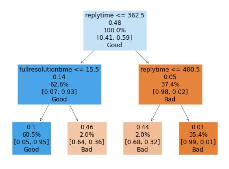

🛎️ Leveraging data analytics and machine learning to improve customer service satisfaction
==============================
[Udacity Nanodegree in Data Science](https://www.udacity.com/course/data-scientist-nanodegree--nd025) - Capstone

Customer Satisfaction is a cornerstone of e-commerce. In this project, I leveraged [data analysis](#analysis), [machine learning](#ml) (including [NLP](#nlp)) and [deployment tools](https://csatisfaction-app.herokuapp.com/) to provide insights and recommendations on how to improve customer service experience.

If you have any questions or suggestions, just send me a 💬 via [LinkedIn](https://www.linkedin.com/in/josecruz-phd/). Enjoy!


Table of Contents
---

1. [About](#about)
  - [Project Overview](#overview)
  - [Analysis](#analysis)
  - [Dashboard with KPIs](#dashboard-with-kpis)
  - [Insights and Recommendations](#insights-and-recommendations)
2. [Repository Contents](#contents)
3. [Installation & Requirements](#installation)
4. [The Data](#data)
5. [Licensing and Acknowledgements](#licensing)


<a id="about"><a/>
## 1. About

<a id="overview"><a/>
### 🔎 Project Overview
---

Customer Satisfaction is a cornerstone of e-commerce. Having a strong customer service satisfaction builds trust and brand reputation which leads to more sales and revenue. Also, improving customer experience improves retention of clients. Bad customer service represents a missed opportunity for revenue.


**How can we leverage customer service data to improve customer satisfaction?**

In this project I further explored 3 sub questions:

  **A.** How do the service current KPIs look like?
  **B.** Can we predict customer satisfaction for missing labels using machine learning?
  **C.** Can we extract the 3 main complaints associated with bad  satisfaction based on comments summited by customers?

<a id="analysis"><a/>
### 📊 Analysis
---

**A. How does the service current KPIs look like?**
In the notebook `notebooks/nb01_data-exploration.ipynb`, I prepared the data and performed exploratory data analysis (EDA).

Main KPIs can be found in my **[ web dashboard](https://csatisfaction-app.herokuapp.com/)**.

**source:** `notebooks/nb01_data-exploration.ipynb`

<a id="ml"><a/>
**B. Can we predict customer satisfaction for missing labels using machine learning?**

Around ~30% the ticket data have missing customer satisfaction label. Using information from EDA, I built a decision tree to predict Good/Bad customer satisfaction based on `replytime`, `fullresolutiontime` and `cpc`(contacts per case). To evaluate the model I used the metric `accuracy` since the target class distribution was not unbalanced.

Model performance on the test dataset was ~95%. We observe that **longer `replytime` and longer `fullresolutiontime` are associated with Bad satisfaction (in orange)**:



**source:** `notebooks/nb02_modeling-part1.ipynb`

<a id="nlp"><a/>

**C. Can we extract the 3 main complaints associated with bad  satisfaction based on comments summited by customers?**

After each interaction with the customer service, customers can leave an optional comment to support their review. Based on these comments, I used NLP for topic modeling with Latent Dirichlet allocation (LDA) to extract the 3 main topics of complaints.


 Briefly, [LDA](https://en.wikipedia.org/wiki/Latent_Dirichlet_allocation) allows sets of observations to be explained by unobserved groups that explain why some parts of the data are similar.

Based on the analysis, the **3 main topics** and some of the words related to those topics are:
- Poor service: *Delivery*, *Inefficient* and *Bad*
- Agent Behavior: *Communication*, *Behavior*, *Slow*
- Customer Experience: *Unreliable*, *Resolution*, *Useless*

**source:** `notebooks/nb03_modeling-part2.ipynb`


### 📈 Dashboard with KPIs

 I used dash/plotly and deployment tools to prepare and **[deploy a dashboard](https://csatisfaction-app.herokuapp.com/)** with all the main KPIs based on the EDA.


### 💡 Insights and Recommendations


**1.** "Payment methods", "wrong passwords" and "items not showing up" are the top complaints. Improving service on these areas will likely reduce the number of tickets and free resources in customer service.

**2.** Reply time and full resolution time are critical CSAT KPIs. Focusing resources on solving tickets that linger without reply will improve CSAT.

**3.** Topic Modeling suggests that agent behavior is sometimes inappropriate and that service is somewhat unreliable. Retrain agents to improve agent satisfaction.


<a id="contents"><a/>
## 2. Repository Contents

    ├── README.md        
    ├── LICENSE
    ├── Procfile
    ├── app.py             <- Dash webapp    
    ├── fig_preparation.py <- Prepare figures for dashboard
    ├── requirements.txt   <- For Heroku web deployment
    ├── data
    │   ├── interim        <- Intermediate data that has been transformed.
    │   ├── processed      <- The final, canonical data sets for modeling.
    │   └── raw            <- The original, immutable data dump.
    │
    ├── docs               <- Support documentation
    │
    ├── notebooks          <- Jupyter notebooks.
    ├── reports            <- PowerPoint Presentation
    │   └── figures        <- Generated graphics and figures
    │
    └── environment.yml    <- conda environment with required python packages


<a id="installation"><a/>
## 3. Installation & Requirements

1. Install a python environment with jupyter notebooks (e.g., [anaconda distribution](https://www.anaconda.com/products/individual)).

2. Create an environment with the required packages by running on the anaconda shell:
```
conda env create -f environment.yml --name myenv
conda activate myenv
```

3. Run individual notebooks in the following order:

  1. `notebooks/nb01_data-exploration.ipynb`
  2. `notebooks/nb02_modeling-part1.ipynb`
  3. `notebooks/nb03_modeling-part2.ipynb`

<a id="data"><a/>
## 4. The Data

The data was made freely available by [5CA](https://5ca.com/) and it is composed by __entirely simulated data__ that mimics real customer service data.

<a id="licensing"><a/>
## 5. Licensing and Acknowledgements

The analysis and code generated during this project are licensed under a MIT License.


## Disclaimer
2022, [José Oliveira da Cruz](https://www.linkedin.com/in/josecruz-phd/)

**_Disclaimer_**
The author is **not affiliated** with any of the entities mentioned nor received any kind of compensation. The information contained in this work is provided on an "as is" basis with no guarantees of completeness, accuracy, usefulness or timeliness.
